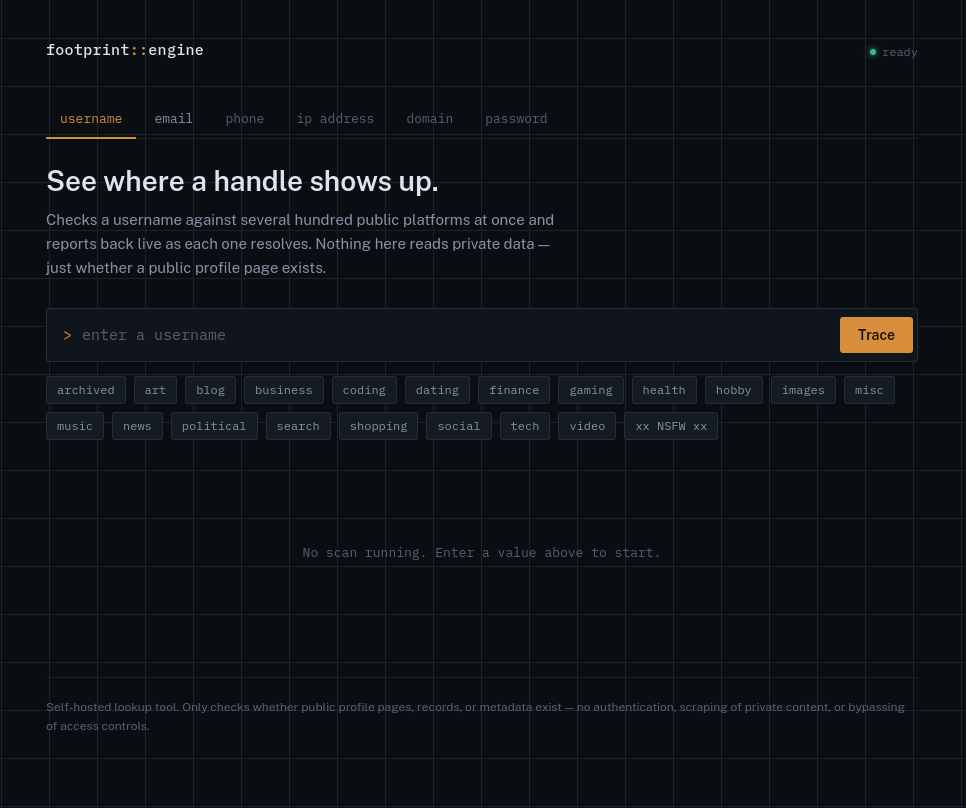
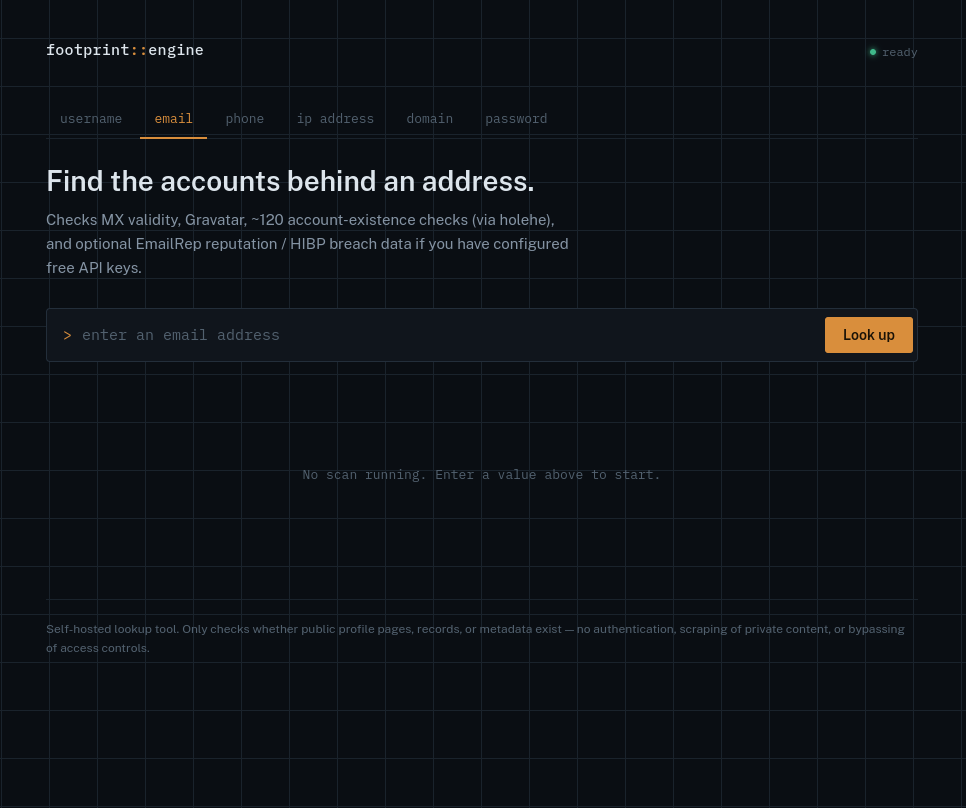
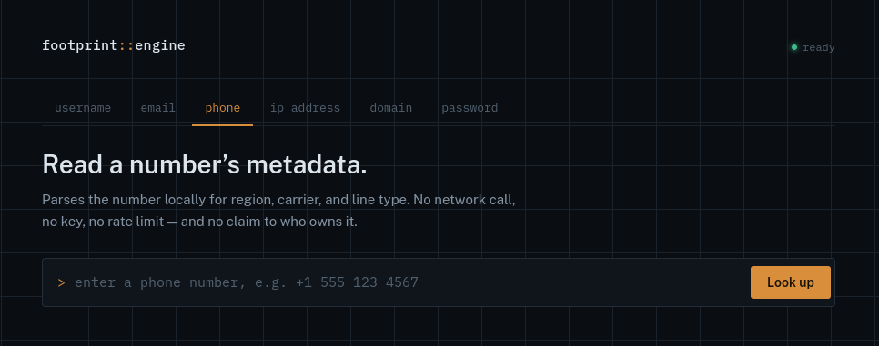
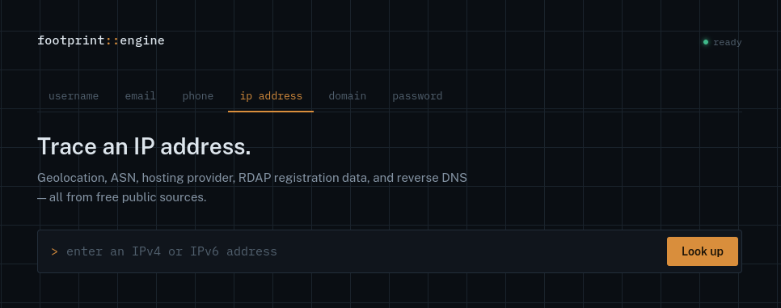
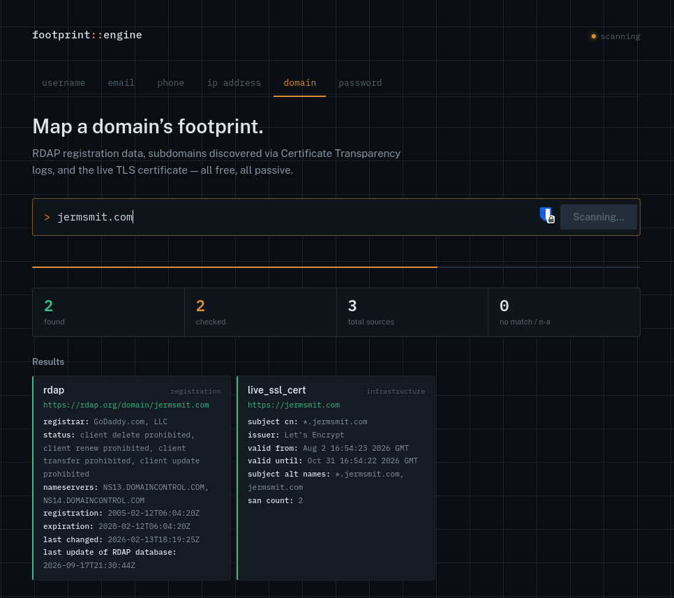
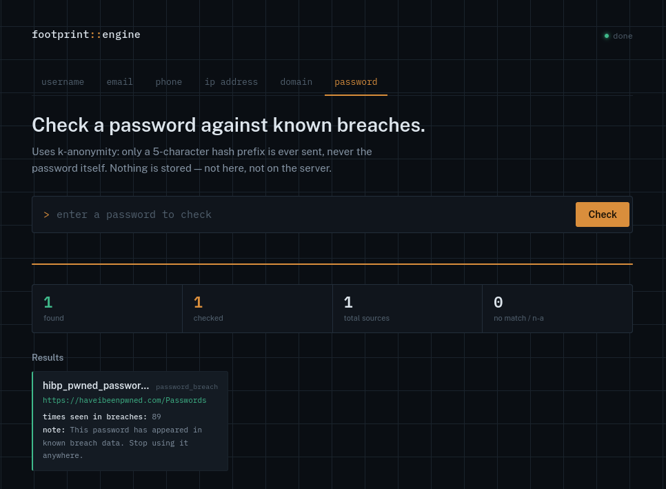

# Footprint Engine

A small, self-hosted OSINT lookup tool. Enter a username, email address,
phone number, IP address, or domain and it checks it against free public
sources concurrently, streaming results into the UI as each one resolves.
Also includes a standalone password-breach checker.

Built to run entirely on free/open data sources by default — no paid API
keys required to use any of it. Two optional keys (HIBP, EmailRep) unlock
richer email data if you choose to add them.

## Screenshots

| | |
|---|---|
|  **Username** — 715+ sites via WhatsMyName, category filters, live streaming results |  **Email** — MX check, Gravatar, ~120 holehe account checks, optional HIBP/EmailRep |
|  **Phone** — carrier/region/line-type, fully offline, no key |  **IP address** — geolocation, ASN, RDAP, reverse DNS |
|  **Domain** — RDAP registration, crt.sh subdomains, live TLS certificate |  **Password** — k-anonymity breach check, never stored |

## What it does today

- **Username lookup**: checks a handle against 700+ sites using the open
  [WhatsMyName](https://github.com/WebBreacher/WhatsMyName) dataset
  (CC BY-SA 4.0). ~33% of sites in the dataset use a machine-facing
  endpoint (often an API) for reliable detection but ship a separate
  human-facing `uri_pretty` URL for the real profile page -- we detect
  against the former and link to the latter, so results point at the
  actual page instead of a raw API endpoint. Also honors each site's
  required custom headers (e.g. a specific User-Agent) where the dataset
  specifies one, instead of always sending our default. For any site that
  comes back `found`, it also parses that page's Open Graph meta tags
  (`og:title`, `og:description`, `og:image`) -- the same tags that make a
  link preview nicely in Slack/iMessage -- to surface a display name, bio
  snippet, and avatar with no extra request, since we already fetched the
  HTML for the existence check. Instagram is checked separately by a
  dedicated collector (`instagram_override.py`) using a private JSON
  endpoint + mobile header, since its public page is a JS-rendered SPA that
  makes the generic plain-HTML approach unreliable there specifically;
  falls back to the plain HTML check if the API path is inconclusive.
  Found results also come with a small "pivot to manual search" panel --
  a handful of pre-built search-engine links (exact match, @mention,
  LinkedIn, GitHub, Pastebin, PDFs) for you to open and read yourself.
  Nothing here is automated or scraped; it's deliberately a trimmed set --
  see `search_pivots.py` for what was left out and why.
- **Email lookup**:
  - MX/DNS validity check — pure DNS, no key.
  - Gravatar profile check — free, no key.
  - **~120 account-existence checks via [holehe](https://github.com/megadose/holehe)** —
    a maintained, open-source library that checks each platform's own
    public signup/password-recovery endpoint. This replaced an earlier
    hand-rolled single-site check; holehe gives real coverage and is
    maintained upstream instead of by us. Each check retries once on
    failure (many failures are transient), and errors are labeled with the
    real cause where we can determine it -- see "Interpreting holehe
    errors" below rather than a single opaque status.
  - EmailRep.io reputation + known-profiles — **optional**, needs `EMAILREP_API_KEY` (free tier).
  - Have I Been Pwned breach exposure — **optional**, needs `HIBP_API_KEY`.
- **Phone lookup**: region, carrier, and line type via `phonenumbers`. Fully
  offline — no network call, no key, no rate limit. Now also includes an
  infostealer-exposure check via Hudson Rock's free Cavalier endpoint (no
  key) -- flags whether a device tied to the number had credentials stolen
  by infostealer malware, surfaced as a summary risk flag only (exposed
  yes/no, infection count, most recent date) rather than the raw masked
  passwords/logins/computer details the underlying API returns.
- **IP lookup**: geolocation/ASN/hosting provider (ip-api.com), RDAP
  registration data, and reverse DNS.
- **Domain lookup** (new): RDAP registration data (registrar, dates,
  nameservers), subdomain discovery via Certificate Transparency logs
  (crt.sh), and a live TLS certificate inspection (direct handshake to
  `{domain}:443` — the same thing your browser reads when it visits the
  site, no third-party API involved).
- **Password breach check** (new, separate tool — not tied to an identity):
  checks a password against HIBP's Pwned Passwords corpus using
  **k-anonymity** — only a 5-character hash prefix is ever sent over the
  network, never the password or full hash. The raw password is never
  written to disk; the scans table stores `[redacted]` for these entries
  (see `backend/main.py::start_scan`).
- Live streaming results via Server-Sent Events (poll-based against
  SQLite — no queue/race conditions on fast scans). Found results appear
  as cards; everything else collapses into a compact table below.
- Results persisted to a local SQLite file so scans survive a restart
  (except passwords, by design).

## Not built yet

- Auth / login gating for exposing this beyond your own network
- Graph view of relationships between discovered entities

## A note on scope

This tool only checks whether *public* data exists for a given indicator —
profile pages, DNS/CT-log records, breach exposure, offline number
metadata, live TLS certs. It doesn't authenticate anywhere, scrape private
content, or aggregate data-broker records. Deliberately **not** included:
any feature that maps a person's name to a home address — that category of
lookup is built by data-broker services scraping voter rolls and property
records specifically to link identity to physical location, and it's the
core mechanism behind doxxing/stalking tooling. Use this on your own
accounts/numbers/domains or with proper authorization, same as any recon
tool.

## Running it

```bash
git clone https://github.com/jermsmit/foorprint-engine.git
cd foorprint-engine
```

### Option A — Docker (recommended)

```bash
cp .env.example .env
# optionally edit .env to add HIBP_API_KEY / EMAILREP_API_KEY
docker compose up --build
```

Then open `http://<host-ip>:8000`.

### Option B — Bare metal (Ubuntu Server)

```bash
chmod +x install.sh
./install.sh
```

To run manually instead of as a service:

```bash
source .venv/bin/activate
uvicorn backend.main:app --host 0.0.0.0 --port 8000
```

## Adding the optional keys

- **HIBP**: get a key at https://haveibeenpwned.com/API/Key, add
  `HIBP_API_KEY=...` to `.env`, restart.
- **EmailRep**: get a free key at https://emailrep.io/key, add
  `EMAILREP_API_KEY=...` to `.env`, restart.

Both are additive only — the app works fully without either.

## Interpreting holehe errors

Email scans will show some sites as `error` rather than `found`/`not_found`.
The `details.reason` field now tells you which of three genuinely different
things happened, instead of one flat "rate limited" label:

- **`timed_out_after_12s_x2_attempts`** — the site never responded in time,
  twice. Usually a slow/overloaded endpoint, sometimes a network issue on
  your end.
- **`<ExceptionType>: <message>`** (e.g. `JSONDecodeError: Expecting value`,
  `KeyError: 'csrf_token'`, `IndexError: list index out of range`) — our
  wrapper caught a real Python exception. These specific error *shapes* are
  a strong tell: a module expecting JSON or a specific HTML field and
  instead getting something else usually means it hit a bot-detection or
  CAPTCHA page instead of the real form, or the site changed its page
  structure since that holehe module was last updated. This is the
  category most likely responsible for real accounts not showing up as
  `found` — the check didn't fail cleanly, it got fed the wrong page and
  choked on it.
- **`site_check_failed_upstream`** — holehe's own module caught something
  internally and just flagged `rateLimit: True` without telling us why (see
  e.g. `modules/*/patreon.py` in the holehe source — this pattern is common
  across their modules). Could be a real HTTP 429, bot detection, or a site
  change; we genuinely can't see further into it without patching holehe's
  own modules.

**Why this happens more from a VPS than your laptop**: many platforms
(social media especially) apply heavier bot-detection to traffic from known
cloud/datacenter IP ranges than to residential IPs or real browser
sessions. A self-hosted server checking ~120 sites in short order looks a
lot more like automated traffic to those sites' defenses than a person
clicking around does. This is a structural limitation of any headless
OSINT tool run from a VPS, not something fully fixable from our side —
each check retries once already, which helps with transient failures, but
a site that's actively challenging your server's IP will keep failing
regardless.

## Project layout

```
footprint-engine/
├── assets/
│   └── screenshots/              # README screenshots
├── docker-compose.yml
├── Dockerfile
├── install.sh
├── requirements.txt
├── backend/
│   ├── main.py                  # FastAPI app + poll-based SSE streaming
│   ├── database.py              # SQLite persistence
│   ├── data/
│   │   └── wmn-data.json        # open username site-check dataset
│   └── collectors/
│       ├── base.py
│       ├── registry.py          # maps indicator_type -> list of collectors
│       ├── username/
│       │   └── site_checker.py
│       ├── email/
│       │   ├── gravatar.py
│       │   ├── mx_check.py
│       │   ├── holehe_collector.py   # wraps the holehe library, ~120 sites
│       │   ├── emailrep.py           # optional, needs EMAILREP_API_KEY
│       │   └── hibp.py               # optional, needs HIBP_API_KEY
│       ├── phone/
│       │   └── libphonenumber_lookup.py
│       ├── ip/
│       │   ├── ip_api.py
│       │   ├── rdap.py
│       │   └── reverse_dns.py
│       ├── domain/
│       │   ├── rdap_domain.py
│       │   ├── crtsh.py
│       │   └── live_ssl_cert.py
│       └── password/
│           └── pwned_password.py     # k-anonymity, never persists plaintext
└── frontend/
    └── index.html                     # single-page UI, tabs for all 6 tools
```

## Adding a new collector

Every collector implements `BaseCollector.run()` as an async generator that
yields normalized hit dictionaries:

```python
{
    "source": "github",
    "category": "coding",
    "status": "found",       # found | not_found | error | unknown | skipped
    "url": "https://github.com/someuser",
    "details": {...}
}
```

Register it in `backend/collectors/registry.py` under the right indicator
type. That's the whole integration surface.
